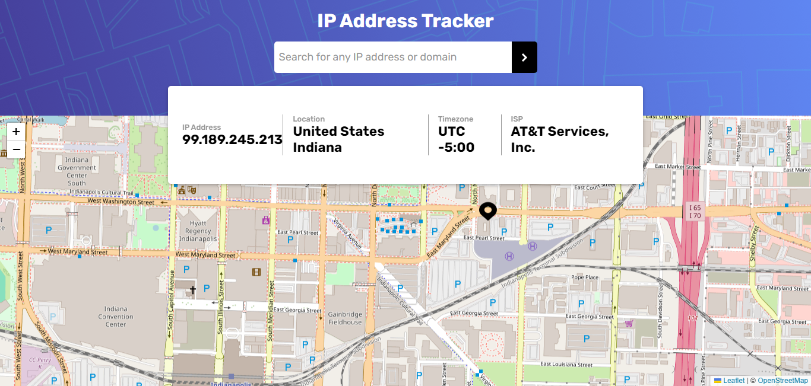
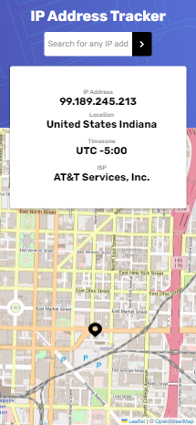

# IP Address Tracker

---

This is a web application that allows users to track IP addresses and view their associated details such as location, timezone, and ISP. It utilizes the [IPGeolocation](https://ipgeolocation.io/) API to fetch IP address details.

## Desktop preview

## Mobile preview

## Features

- Track any IP address.
- View details such as IP address, location, timezone, and ISP.
- Interactive map display of the location associated with the IP address.

## Technologies Used

 (for displaying maps)

## Links

- [live demo](https://ip-address-tracker-eyuleo.vercel.app/)

## Contributing

Contributions are welcome! If you have any ideas, enhancements, or bug fixes, feel free to open an issue or submit a pull request.

## License

This project is licensed under the MIT License.
